# Browser Technologies
[Live Demo](https://web-dev-enquete.herokuapp.com/)

## Table of contents

1. [How to install](#How-to-install)     
2. [Week 1](#week-1)     
2.1. [Beperkingen van client](#beperkingen-van-client)   
2.1.1. [Afbeeldingen uitzetten](#afbeeldingen-uitzetten)           
2.1.2. [Font uitzetten](#font-uitzetten)    
2.1.3. [Kleur uitzetten & kleurenblindheid instellen](#kleur-uitzetten--kleurenblindheid-instellen)    
2.1.4. [Muis/Trackpad werkt niet](#muistrackpad-werkt-niet)    
2.1.5. [Breedband internet uitzetten](#breedband-internet-uitzetten)    
2.1.6. [Javascript (volledig)](#javascript-volledig)    
2.1.7. [Cookies niet accepteren](#cookies-niet-accepteren)    
2.1.8. [localStorage doet het niet](#localstorage-doet-het-niet)    
2.2. [Tests op verschillende browsers](#tests-op-verschillende-browsers)          
2.2.1. [Microsoft edge (Desktop)](#microsoft-edge-desktop)    
2.2.2. [Firefox (Desktop)](#firefox-desktop)    
2.2.3. [Safari (Mobile/iPad) & Chrome (iPad)](#safari-mobileipad--chrome-ipad)    
2.2.4. [Firefox (Mobile)](#firefox-mobile)    
2.2.5. [Internet Explorer (Desktop)](#internet-explorer-desktop)   
2.3. [Screenreader](#screenreader)  
3. [Week 2](#week-2)    
3.1. [Use case](#use-case)    
3.2. [Functional/reliable](#functionalreliable)   
3.3. [Usable](#usable)    
3.4. [Pleasurable](#pleasurable)  
3.5. [Browser Technologies/features](#browser-technologiesfeatures)     
3.6. [Feedback week 2 toevoegingen](#feedback-week-2-toevoegingen) 
4. [Rangeinput slider](#rangeinput-slider)  
5. [Kopieer knop](#kopieer-knop)    
5.1. [Main events](#main-events)     
5.1.1. [Eerste keuze (Async Clipboard API)](#eerste-keuze-async-clipboard-api)   
5.1.2. [Tweede keuze (Document API + DataTransfer API)](#tweede-keuze-document-api--datatransfer-api)    
5.1.3. [Benodigde API's](#benodigde-apis)    
5.1.4. [Verificatie](#verificatie)   
5.1.5. [Verwerking bevindingen](#verwerking-bevindingen)     
5.1.6. [Document API: copy event](#document-api-copy-event)  
5.1.7. [DataTransfer API: setData](#datatransfer-api-setdata)    
5.1.8. [Best keuze](#best-keuze)     
5.2. [Fall back](#fall-back)     
5.3. [Hoe werkt het?](#hoe-werkt-het)    
5.3.1. [Hoe maak ik de knop zichtbaar?](#hoe-maak-ik-de-knop-zichtbaar)     
5.3.2. [Hoe wordt tekst gekopieerd?](#hoe-wordt-tekst-gekopieerd) 
6. [Pleasurable](#pleasurable-1)
7. [Alle lagen](#alle-lagen)
8. [Conclusie/samenvatting](#conclusiesamenvatting)

## How to install

**Step 1:** Clone project:
```git
git clone https://github.com/meessour/browser-technologies-1920.git
```

**Step 2:** CD to path where project is cloned to:
```git
cd C:/../..
```

**Step 3:** Install packages:
```git
npm install
```

**Step 4:** Start the server:
```git
npm start
```

**Step 5:** Navigate to: http://localhost:3000/

## Week 1

Deze sectie gaat over toepassingen van Progressive enhancement. Er wordt getest via de Chrome browser via desktop

### Beperkingen van client

Ik ga deze web app testen op de volgende beperkingen:
- Afbeeldingen uitzetten
- Custom fonts uitzetten
- Kleur uitzetten & kleurenblindheid instellen
- Muis/Trackpad werkt niet
- Breedband internet uitzetten
- Javascript (volledig)
- Cookies niet accepteren
- localStorage doet het niet

#### Afbeeldingen uitzetten
Na het uitzetten van de afbeeldingen was de titel/omschrijving van de app niet te lezen. Dit komt omdat de achtergrond en text dezelfde kleur hebben
<details>
<summary>Zie voorbeeld</summary>


</details>

De tweede bevinding is dat de achtergrond van de zoekresultaten niet te zien is omdat het dezelfde kleur is als de achtergrond.

Ook wordt er een iccontje getoond op de locatie waar normaal de foto van de artiest te zien is. 
**Fix: de achtergrond afbeelding vervangen door linear gradient, en fallback daarop één solid kleur** 

Daarnaast is de outlining van verschillende artiesten in de lijst niet gelijk.
<details>
<summary>Zie voorbeeld</summary>

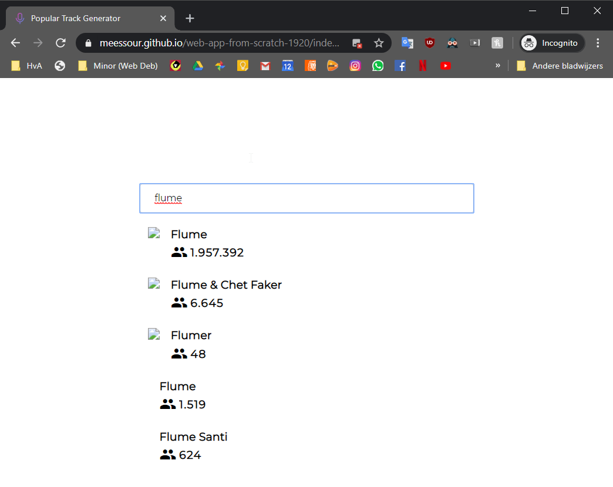
</details>

**Fix: de img tag wordt nu ingeladen, check server-side of er uberhaupt een afbeelding aanwezig is, zo niet dan laat ik dit element weg (Dat doet de templating engine)** 

Tot slot is er in de resultaten lijst een te grote afstand tussen de positienumering en tracknaam.
<details>
<summary>Zie voorbeeld</summary>


</details>

**Fix: zelfde principe als de fix hierboven** 

#### Font uitzetten
Na het uitzetten van de font functioneert de site nog exact hetzelfde. Door de automtische "fallback" font is de text moeilijker te lezen en past het niet bij de site.

<details>
<summary>Zie voorbeeld</summary>


</details>

**Fix: font family verandren van sans naar sans-serif** 

#### Kleur uitzetten & kleurenblindheid instellen
Na het uitzetten van de kleuren is alles op de site nog goed te lezen. Wel is het moeilijk om de track resultaten sectie te onderscheiden van de achtergrond, ze hebben allebei een zwarte kleur nu. 

<details>
<summary>Zie voorbeeld</summary>


</details>

**Fix: achtergrond kleur veradnren (linear-gradient en fallback zoals omschreven in Afbeeldingen uitzetten)** 

#### Muis/Trackpad werkt niet
Het is mogelijk om via TAB en/of SHIFT+TAB te navigeren tussen klikbare elementen op de site. Dit zijn: de zoekbalk, de zoekresultaten en open een track in spotify. Elementen zijn te selecteren door op ENTER te klikken.

#### Breedband internet uitzetten
Na het uitzetten van het internet wordt er autmoatisch een foutmedlign gegeven aan de gebruiker, alleen bevat deze geen tekstinhoud. Dit gebeurd zodra de gebruiker probeert te zoeken op een term of een zoekresultaat aan klikt.

<details>
<summary>Zie voorbeeld</summary>


</details>

**Fix: een standard fallback toeveogen aan de feedback message zodat er altijd wat getoond wordt. In dit geval iets in de richting van: "Er ging iets mis"** 

#### Javascript (volledig)
Na het uitzetten van javascirpt worden er geen zoekresultaten en track resultaten weer gegeven. Er wordt ook geen feedback aan de gebruiker gegeven waardoor de grbuiker niet weet wat er aan de hand is. Het kan er voor zorgen dat de gebruiker denkt dat er nog wat geladen moet worden en kijkt vervolgens dan voor een lange periode naar het scherm, hopende dat er nog wat geladen zal worden.

<details>
<summary>Zie voorbeeld</summary>

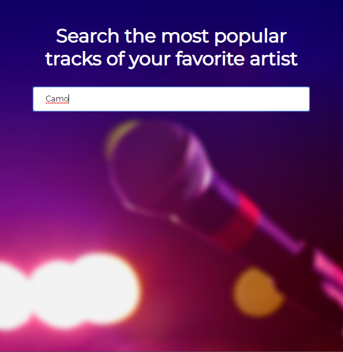

</details>

**Fix: Inprincipe wordt alles nu client-side gedaan. De fix hiervoor zou zijn om veel van de logica enz. server-side te doen.** 

#### Cookies niet accepteren
Na het uitzetten van de cookies worden er geen zoekresultaten en track resultaten weer gegeven. Er wordt een fout melding gegeven.

<details>
<summary>Zie voorbeeld</summary>

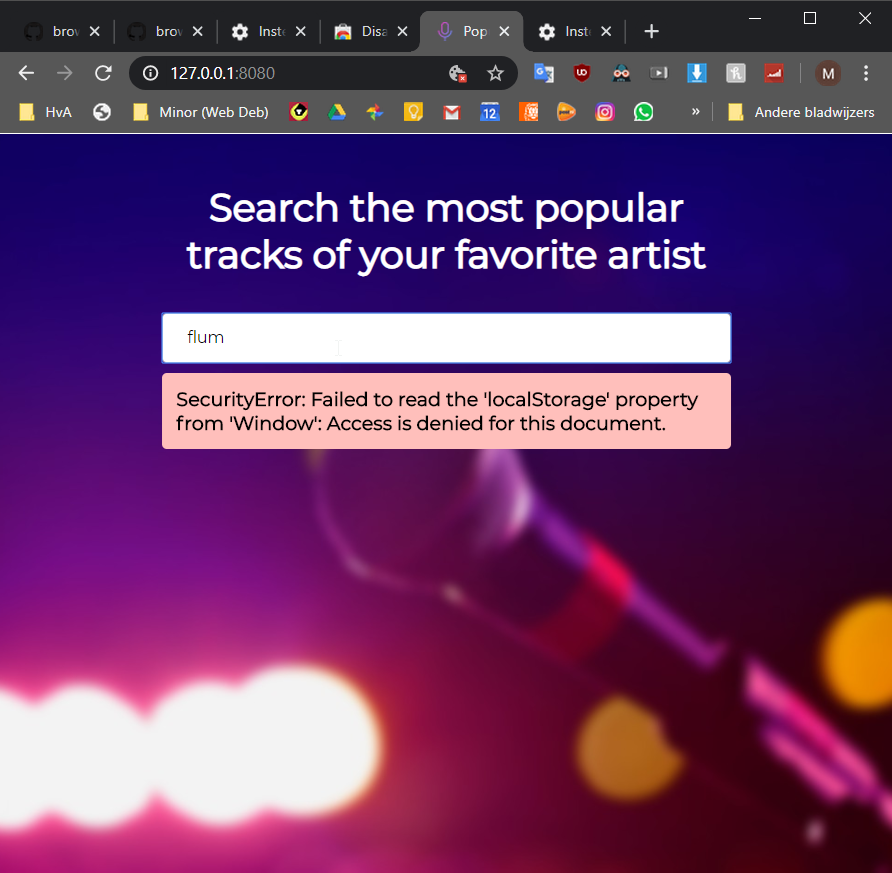

</details>

**Fix: Dit was een bug dat de token altijd uit local storage gehaald moest worden. In plaats daarvan returned de getToken() method nu de token, of vanuit de API of localstorage.** 

#### localStorage doet het niet
Na het uitzetten van de localStorage worden er geen zoekresultaten en track resultaten weer gegeven. Er wordt een fout melding gegeven.

<details>
<summary>Zie voorbeeld</summary>


</details>

**Fix: Dit was een bug dat de token altijd uit local storage gehaald moest worden. In plaats daarvan returned de getToken() method nu de token, of vanuit de API of localstorage.** 

### Tests op verschillende browsers

#### Microsoft edge (Desktop)
In microsoft edge werkte alles prima, alleen is er een visuele beperking bij het verkleinen van het scherm. De gebruiker is in staat om buiten de content (naar rechts) te scrollen. Het lijkt wel alsof er geen maxmimale width aanwezig is.

<details>
<summary>Zie voorbeeld</summary>


</details>

**Fix: Dit kwam weer door de background image die ik gebruikt had. Met de fix uitgelegd in Afbeeldingen uitzetten verhelpt het ook deze bug**

Daarnaast werd er een waarschuwing in the console getoond: 
```SEC7139: [CORS] The origin 'https://meessour.github.io' used the maximum Access-Control-Max-Age value of '604800' as the provided value exceeded this for a cross-origin request to 'https://api.spotify.com/v1/search?q=k&type=artist&limit=5'. ```

#### Firefox (Desktop)
Op Firefox (desktop) functioneerde alles naar wens

#### Safari (Mobile/iPad) & Chrome (iPad)
In Safari op een iPhone/iPad en Chrome op een iPad, waren er enkele visuele problemen. De titel van de site heeft een te grote afstand per letter. Voor een fractie van een seconde ziet de achtergrond er vreemd uit.

<details>
<summary>Zie voorbeeld iPhone Safari</summary>

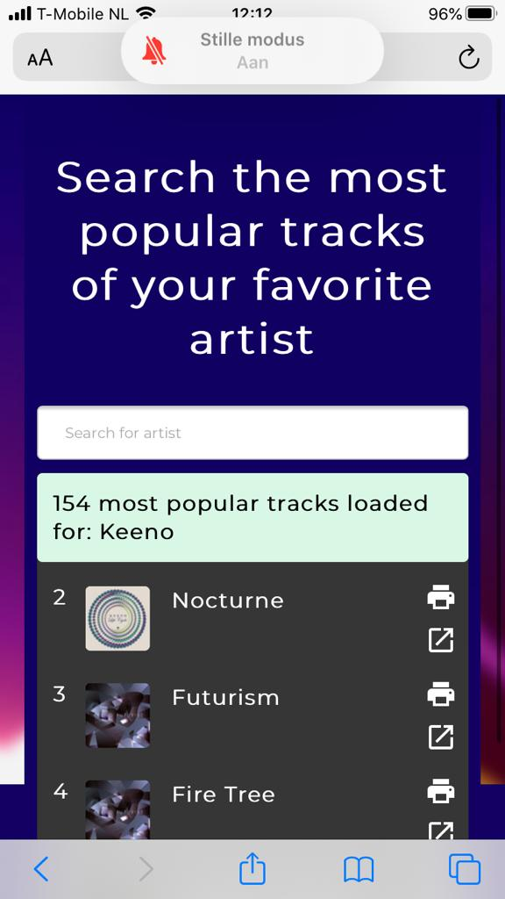
</details>

<details>
<summary>Zie voorbeeld iPad Chrome</summary>

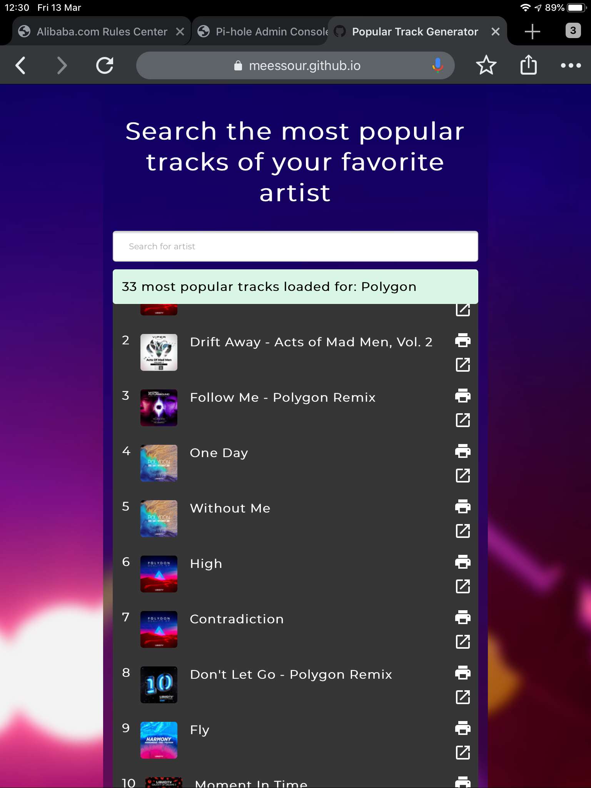

</details>

Daarnaast is de outlining van track items niet hetzelfde (Niet het geval op iPad (Chrome/Safari)).

<details>
<summary>Zie voorbeeld iPhone Safari</summary>

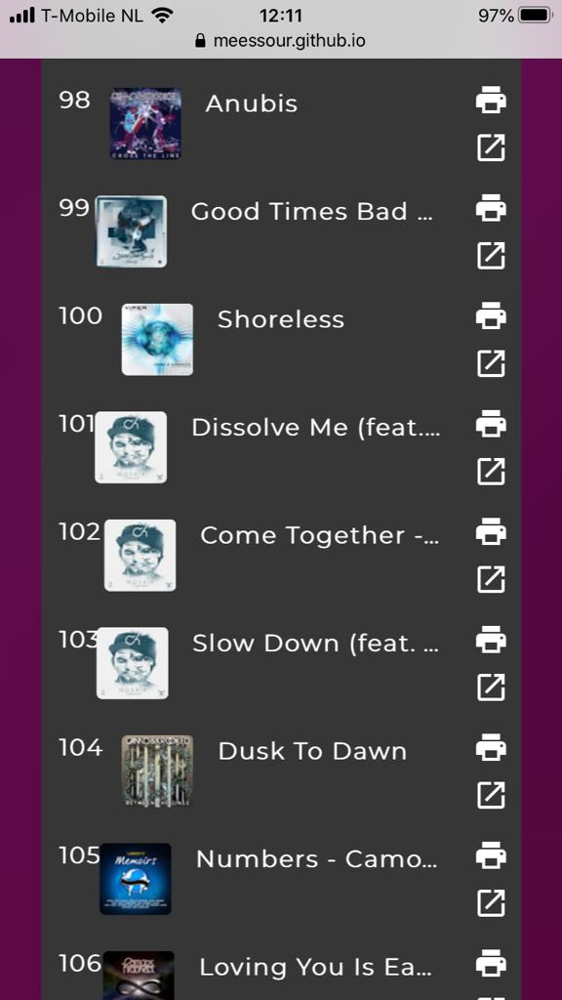

</details>

**Fix: Dit kwam weer door de background image die ik gebruikt had. Met de fix uitgelegd in Afbeeldingen uitzetten verhelpt het ook deze bug**


#### Firefox (Mobile)
In Firefox op een mobiel werkte alles naar wens. Er was alleen een ongewenste visuele eigenschap tijdens het indrukken van de zoekbalk. De zoekbalk werd dan heel erg transparant, waardoor de placeholder tekst niet meer goed te lezen was

<details>
<summary>Zie voorbeeld</summary>

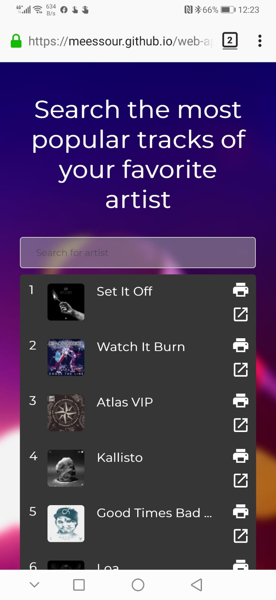

</details>

**Fix: Search balk een achtergrond kleur wit geven**

#### Internet Explorer (Desktop)
In Internet Explorer werkte eigenlijk helemaal niks. Geen items werden ingeladen, er werd geen user feedback gegeven en de console gaf wat warnings en errors. Visueel zag alles er normaal uit.

<details>
<summary>Zie voorbeeld</summary>

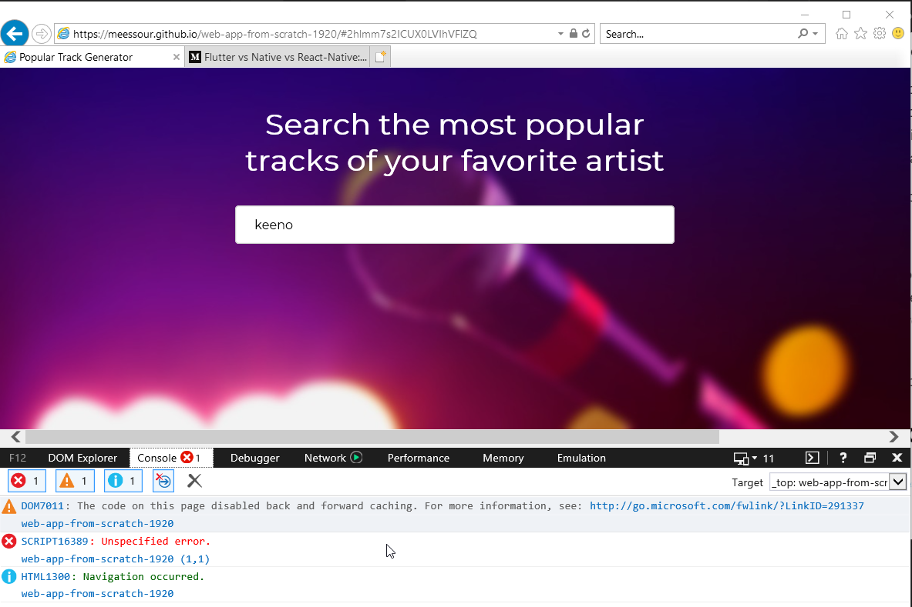

</details>

**Fix: Veel kan gefixed worden als het server-side gedaan zou worden.**

### Screenreader
Voor het uitlezen van de inhoud van de site gebruikt ik (Pericles: Text to Speech Screen Reader): https://chrome.google.com/webstore/detail/pericles-text-to-speech-s/oacindbdmlbdeidohafnfocfckkhjlbg

De titel/omschrijving van de site werd opgelezen en all track resultaten. De zoek resultaten van de artiesten werden niet opgelezen.

<details>
<summary>Zie wat niet werd voorgelezen</summary>


</details>

**Fix: Alles was wrapped in een a tag. Nu is dat niet meer het geval en wordt de text uitgelezen**

## Week 2

<details>
<summary>Zie bevindingen van week 2</summary>

### Use case
**Ik wil een enquete kunnen invullen over de minor Web Development, met verschillende antwoord mogelijkheden. Als ik de enquete niet afkrijg, wil ik later weer verder gaan met waar ik ben gebleven.**

In deze wireframe/wireflow zie je een schets van hoe de app er uit moet komen te zien.

<details>
<summary>Wireframe</summary>

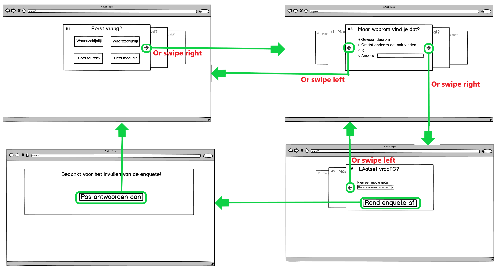

</details>

De gebruiker kan vragen beantwoorden op verschillende manieren. Deze manieren zijn: meerkeuze vragen, radio-button vragen, vragen waar een antwoord uitgeschreven moet worden en een getal als antwoord. De gebruiker kan op de knoppen klikken om naar de vorige of volgende vraag te komen. Als de gebruiker een touchscreen heeft, dan kan er ook geswiped worden om tussen de vragen te wisselen. Ook is er de mogelijkheid om met pijltoetsjes heen en weer te gaan.

### Functional/reliable
De core-funtionaliteit van de site is om voor gebruikers een enquete in te vullen. Dit wordt bereiekt doormiddel van verschillende input manieren. De gebruiker kan navigeren door de enquete om de andere vragen te kunnen zien. Tot slot kan de gebruiker de enquete inleveren en de antwoorden aanpassen.

De site is betrouwbaar omdat de gebruiker zijn/haar antwoorden kan bekijken en veranderen. Daarnaast bewaart de site de antwoorden die de gebruiker ingevuld had. Hierdoor kan de gebruiker later de enquete verder invullen.

Dit zijn de verschillende HTML tags (semantische HTML elementen) die gebruikt zullen worden voor de structuur:

* Het indrukken van een knop
    * Hiervoor gebruik ik de ```<a>``` tag. Met de a tag kan je tabben op desktop, vandaar dat ik deze gebruik.
* Een antwoord kiezen van radio buttons
    * Hiervoor gebruik ik de input tag met als type **"radio"**: ```<input type="radio">```
* Meerdere antwoorden kiezen via checkboxes
    * Hiervoor gebruik ik de input tag met als type **"checkbox"**: ```<input type="checkbox">```
* Via een tekstveld
    * Hiervoor gebruik ik de input tag met als type **"text"**. Text is de standard type dus dat geef ik niet aan: ```<input>```
* Via een text area
    * Hiervoor gebruik ik de textarea tag: ```<textarea>```
* Via een dropdown
    * Hiervoor gebruik ik de select tag: ```<select>``` met daarin option tags: ```<option>```
* Via een range slider
    * Hiervoor gebruik ik de input tag met als type **"range"**: ```<input type="range">```
* Een kleur kunnen kiezen (Als de browser het support anders negeren)
    * Hiervoor gebruik ik de input tag met als type **"color"**: ```<input type="color">```

Al deze input types worden in een form tag ```<form>``` gezet met aan ```action=""``` atribute.

Elke vraag wrap ik in de tag ```<fieldset>``` met daarin een ```<legend>``` tag voor de titel. 

De titel van de vraag en andere benadrukking gebruik ik de ```<strong>```tag.

Als de gebruiker de optie "Anders" kiest bij een checkbox vraag, dan gebruik ik de ```<span>``` tag om de ```<input>``` inline naast de tekst te zetten.

Voor opmaak van tekst gebruik ik de titel tags: ```<h1>```, ```<h2>```, etc. Voor overige tekst gebruik ik de ```<p>``` tag

Tot slot gebruik ik ```<div>``` tags voor de algemene structuur van de site.

Voor het styling van de site gebruik ik zo veel mogelijk semantische HTML tags. Dit zijn onder andere de ```<fieldset>``` die voor een goed uitziende container zorgen, waarbij CSS niet nodig is. De knoppen om van pagina te wisselen is gewoon een stukje text in een a tag door gebruik te maken van de code **"&#8250;"**. Hier is een voorbeeld te zien van stlying door middel van semantische HTML tags:

<details>
<summary>Preview semantische HTML tags</summary>

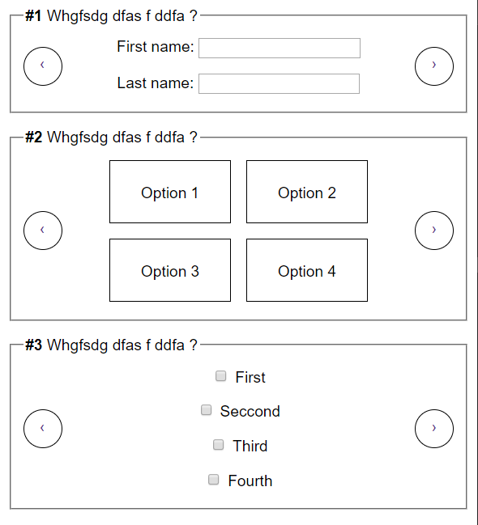

</details>

### Usable
De website is eenvoudig en focused zich op één specifiek doel. Dit doel is het beantwoorden van een vragenlijst. Andere functies die helpen bij het bereiken van dit doel zijn: Het gemakkelijk inzien van alle (al beantwoorden) vragen die de enquete bevat, het kunnen beatnwoorden/aanpassen van een (gegeven) antwoord en het onthouden waar de gebruiker gebleven was met de vragenlijst.

### Pleasurable
De site geeft duidelijk weer welke vraag de gebruiker aan het antwoorden is en welk(e) antwoord(en) beatnwoord is/zijn. Door gebruik te maken van gebaren (zoals het kunnen swipen met een touchscreen of pijltoetsen op een toetsenbord), kan de gebruiker op een intuitieve en effevtieve manier zijn/haar doel bereiken. Door alleen relevante elementen/funcitonaliteiten te gebruiken is de site minimaal en voelt daarom proffesioneel aan. Er zijn subtiele animaties om de site prettiger aan te laten voelen maar niet dat het een afleidend effect heeft.

### Browser Technologies/features
De volgende features zijn van toepassing op de site:
* Een animatie voor het springen van vraag naar vraag
    * **@keyframes** wordt gebruikt om op een gecontroleerde manier van een bepaalde styling state naar een andere over te gaan.
        * Wordt ondersteund op alle browsers
    * **animation** wordt gebruikt om de animatie te tonen
         * Wordt ondersteund op alle browsers
* Checken hoe breed het scherm is en op basis daarvan de preview tonen van de andere vragen. Als het scherm te klein is zou dit niet getoond moeten worden.
    * **@media** wordt hiervoor gebruikt
        * Wordt ondersteund op alle browsers
* Een filter toepassen om de andere vragen te blurren.
    * **CSS Filter Effects** wordt hiervoor gebruikt met **blur**
        * Wordt niet ondersteund op IE.    
            * De fallback wordt dan om **Opacity** te gebruiken
* Het kunnen navigeren tussen de vragen.
    * **addEventListener** wordt gebruikt om vershcillende handelingen te detecteren
        * Wordt ondersteund op alle browsers
    * **touchstart** en **touchmove** en **touchend** worden gebruikt als listener om een swipe beweging te detecteren. Deze events zijn van toepasing bij een touchscreen bijvoorbeeld.
        * Wordt niet onderstuend op IE, Safari en Opera. Deze feature is optioneel en er kan gebruik worden gemaakt van de knoppen als fallback.
    * **mousedown** en **mousemove** en **mouseup** worden gebruikt als listener om een veeg beweging te detecteren van een muis
        * Wordt ondersteund op alle browsers
    * **onkeydown** wordt gebruikt als loistener om te detetcteren of een pijltoets is ingeklikt. niet bij elke browser wordt de listener **onkeypress** getriggered bij het inklikken van de pijltoetsen., daarom gebruyik ik deze niet. Deze functie is optioneel en zou alleen werken als de gebruiker een toetsenbord heeft
        * Wordt ondersteund op alle browsers
    * **click** word gebruikt als listener om te detecteren of een knop is ingeklikt. Dit wordt ook gebruikt als fallback voor als alle andere events hierboven niet werken.
        * Wordt ondersteund op alle browsers
* Om een thema te kiezen, in de vorm van een subtiele achtergrond kleur, wordt er aan de gebruiker gevraagd om deze kleur op te geven.
    * de input type **color** wordt hiervoor gebruikt.
        * Dit wordt niet onderstuend op IE en wordt in plaats daarvan niet gevraagd aan de gebruiker. Als de gebruiker IE gebruikt of geen kleur kiest, is de fallback kleur gewoon wit.

Om mijn site zo responsive mogelijk te maken, gebruik ik een ```<meta>``` viewport element in mijn header. Door dit te doen stel ik de paginabreedte in om de schermbreedte van het appraat te volgen. Ook stel ik de initiele zoomniveau in op 100% (niet ingezoomed).
```html
<meta name="viewport" content="width=device-width, initial-scale=1.0">
```

### Feedback week 2 toevoegingen
Wat ik heb begrepen van de feedback sessies is dat er alleen gekeken wordt naar de HTML, CSS en JS. Om alles altijd te laten werken ben ik daarom van plan waarschijnlijk grotendeels server-side te doen, maar hier wordt niet naar gekeken. Is dit wel de bedeoeling of resulteert dit in mij die te veel tijd aan onnodige dingen besteed?

Tot nu toe heb ik alleen getest in Chrome, maar check ik wel de hele tijd caniuse.com. Als ik stackoverflow gebruik voor tips, kijk ik altijd in het antwoord/comments of iemand iets over browser-support mentioned. 

Tot slot wou ik initieel veel verschillende features maken en die allemaal laten werken, alleen weet niet zeker of dit de meest slimme manier is om deze opdracht te maken. Dit wou ik eerst doen om een zo hoog mogelijk cijfer te halen, maar weet niet eens zeker of ik dat met deze methode kan bereiken. Mijn vraag is dus ook, wat moet ik doen/waar moet ik op letten om zo'n hoog mogelijk cijfer te halen? Ik hoorde dat ik een hoger cijfer krijg als ik kan uitleggen/aantonen hoe de drie versdchillende lagen differentiëren van elkaar. Hoe kan ik dit verwerken/aantonen in mijn product?

## Rangeinput slider

Source:
http://mobile-web-app.blogspot.com/2012/03/easy-display-value-for-of-slider-in.html

Hier gebruik ik een output tag om de waarde weer te geven:
```html
<input id="rangeinput" type="range" min="0" max="10" value="5" onchange="rangevalue.value=value"></input>
<output id="rangevalue">5</output>
```

Anders had ik javasciprt moeten gebruiken om de waarde te kunnen tonen:
```html
<input id="rangeinput" type="range" onchange="updateTextInput(this.value);"></input>
<input type="text" id="textInput" value="">

function updateTextInput(val) {
    document.getElementById('rangeinput').value=val; 
}
```

Om in de HTMl < en > te gebruiken, gebruik ik "&lt;" en "&gt;"

In plaats van een image/icon/vector gebruik ik een html tag voor de pijl iconen.
Afkomstig van: https://www.alt-codes.net/arrow_alt_codes.php
HTML code voor pijl: **&#x21FD;** en **&#x21FE;**

</details>

## Kopieer knop
### Main events
#### Eerste keuze (Async Clipboard API)

Voordelen:
*	Tekst kan gekopieerd worden direct van een variabele waarde.
*	Werkt asynchroon in javascript, dus het hindert niet andere processen.
*	Sinds Chrome 66 kunnen pagina's in actieve tabbladen zonder toestemming te geven, kopiëren naar het klembord van de gebruiker.

Nadelen:
*	Heeft hele slechte browser support (zie afbeelding hieronder). Maar Meer dan 28% van de gebruikers kan dit niet gebruiken
*	Kan alleen gebruikt worden als de pagina wordt aangeboden via HTTPS. 

Werkt volgens caniuse.com. Dezelfde data is te zien op de developer.mozilla.org/

<details>
<summary>CaniUse.com resultaten</summary>

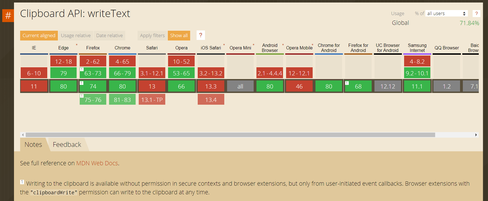
</details>

<details>
<summary>developer.mozilla.org resultaten</summary>

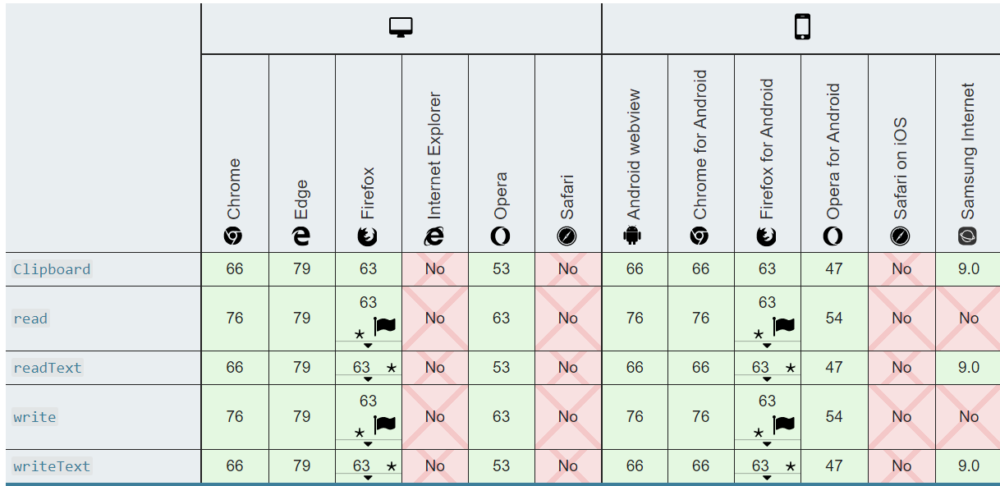
</details>

Om te dubbel checkte of dit werkte heb ik het getest op Safari - Desktop, IE11 en iOS 13.3 – Safari. Uit deze tests bleek dit niet te werken op IE11 en Safari – Desktop. Wel werkte deze functionaliteit op Safari iOS 13.3 (iPhone 8) en Safari iOS 13.4 (iPad). Bewijzen:

<details>
<summary>Safari iOS 13.4 (iPad)</summary>

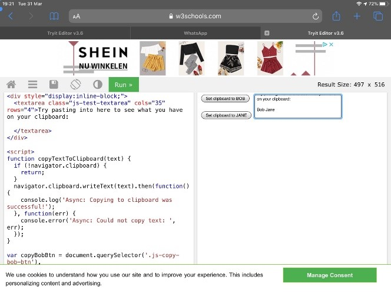
</details>
<details>
<summary>Safari iOS 13.3 (iPhone 8)</summary>

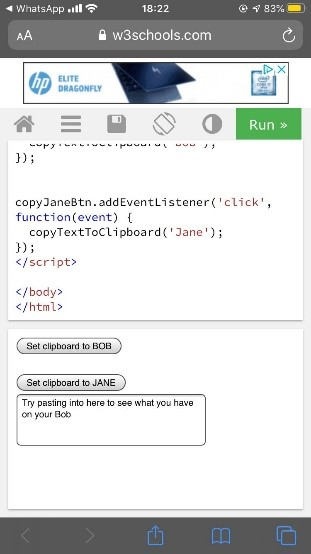
</details>
<details>
<summary>Safari - Desktop</summary>

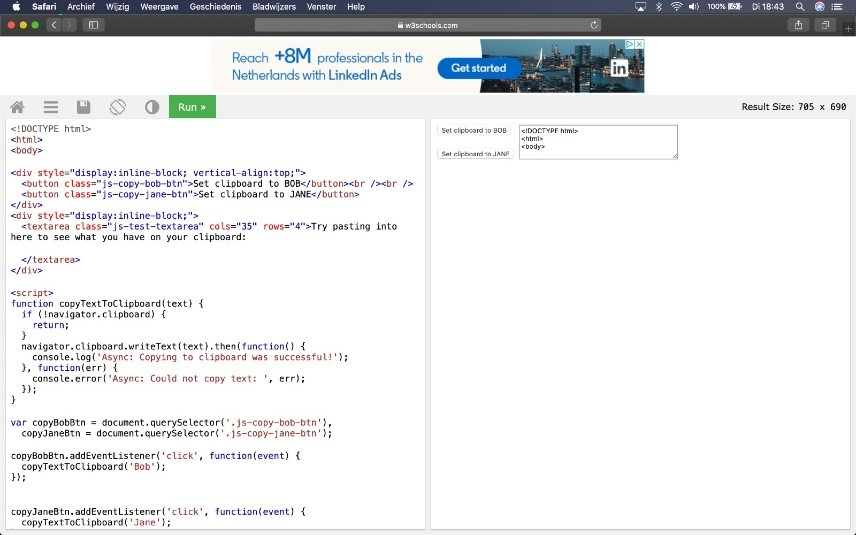
</details>

Dit zou betekenen dat het percentage tussen de 9.3% - 12.9% hoger komen te liggen. Het percentage zou dus liggen tussen de 81.1% en 84.7%.

#### Tweede keuze (Document API + DataTransfer API)

Voordelen: 
*	Tekst kan gekopieerd worden direct van een variabele waarde.
*	Sinds Chrome 66 kunnen pagina's in actieve tabbladen zonder toestemming te geven, kopiëren naar het klembord van de gebruiker.
*	Werkt op grotendeels van de browsers

Nadelen:
*	De code nodig om dit uit te voeren werkt synchroon. Dit betekent dat het de javascript op de pagina stopt tot de taak voltooid is.

Hieronder meer uitleg over deze aanpak en hoe het gebruikt wordt.

#### Benodigde API's

Er kan ook gebruik gemaakt worden van de Document API, door middel van een event listener:
Via Document API: execCommand kan er een kopieer evenement uitgevoerd worden (Dit kan gebruikt bij het klikken van een knop):

```javascript
document.execCommand('copy');
```

document.execCommand('copy');
Dit copy event kan ook aangeroepen worden door CRLT+C te klikken of vanuit het context menu. Hierdoor hoeft de gebruiker alleen een toetsenbord te gebruiken en/of alleen de muis. Dit zorgt er voor dat de site beter usable is.
Daarnaast wordt er gebruik gemaakt van Document API: copy event met daarin de DataTransfer API: setData:

```javascript
document.addEventListener('copy', (event) => {
    event.clipboardData.setData('text/plain', 'Desired Value');
    event.preventDefault(); // default  ehavior is to copy any selected text});
});
```

Hier nog even alle API’s op een rijtje:  
*	Document API: execCommand 
*	Document API: copy event
*	DataTransfer API: setData

Hieronder ga ik verder in op deze API’s

#### Wat wordt waar ondersteund

Gelukkig wordt de execCommand bijna overall support en kan gebruikt worden door meer dan 95% van de gebruikers.

<details>
<summary>Document API: execCommand op CanIuse.com</summary>

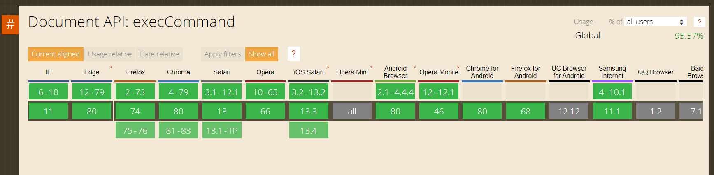
</details>

De copy event wordt helaas door minder browsers ondersteund. Wel ligt het percentage hoger dan bij de Clipboard API (71%). Daarnaast werkt de copy event op meer browsers, zoals: Safari (vergeleken met Clipboard API). Als het niet aan de DataTransfer API lag, was dit de betere alternatief geweest. Hieronder een overzicht van de DataTransfer API.

<details>
<summary>Document API: copy event op CanIuse.com</summary>

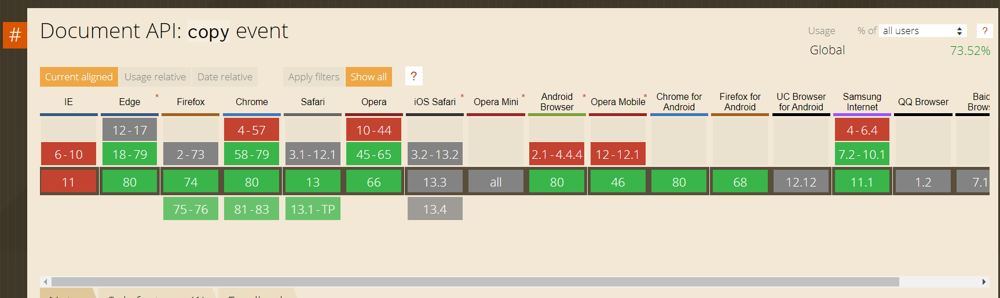
</details>

De setData command van de DataTransfer API wordt door veel browsers onderstuend, maar is toch maar te gebruiken bij de helft van de gebruiekrs.

<details>
<summary>DataTransfer API: setData op CanIuse.com</summary>

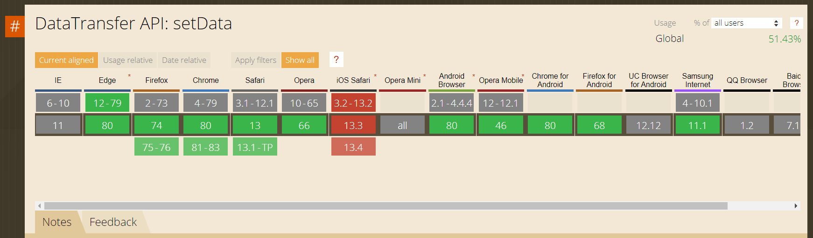
</details>

Dit komt omdat veel van de gebruikers oudere versies van chrome en firefox gebruiken, waar samen maarliefst een kwart van de grbuikers gebruik van maken.

<details>
<summary>DataTransfer API: setData staafdiagram op CanIuse.com</summary>

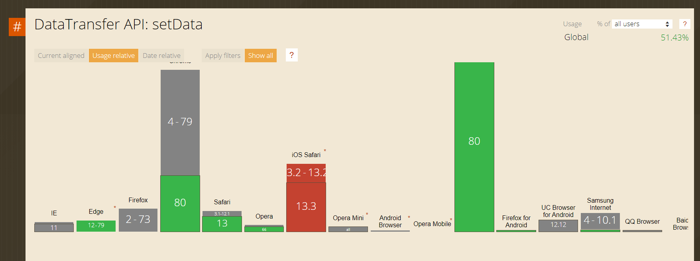
</details>

#### Verificatie

Ik vond het een beetje gek dus checkte ik dubbel op de developer.mozilla.org/ website, en daar bleek het op alle versies van chrome en firefox te werken. 

<details>
<summary>DataTransfer API: setData op developer.mozilla.org</summary>

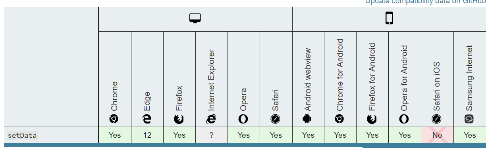
</details>

Dus ik ging dat uit testen. Ik gebruik hiervoor een website genaamd browserstack.com om op oudere browsers te testen. In deze test gebruikte ik chrome verise 50. Ik ging naar een stackoverflow post waar een code snippet aanwezig was met de DataTransfer API (https://stackoverflow.com/a/36380702/11119707). In de snippet kun je op een knop klikken en vervolgens wordt de tijd geklopieerd naar je klembord. Bij de snippet is er een veld waar je je inhoud handmatig kan plakken. Na dat ik plakte zag ik de huidige tijd in het tekstvak. 

<details>
<summary>Chrome 50 werkend</summary>

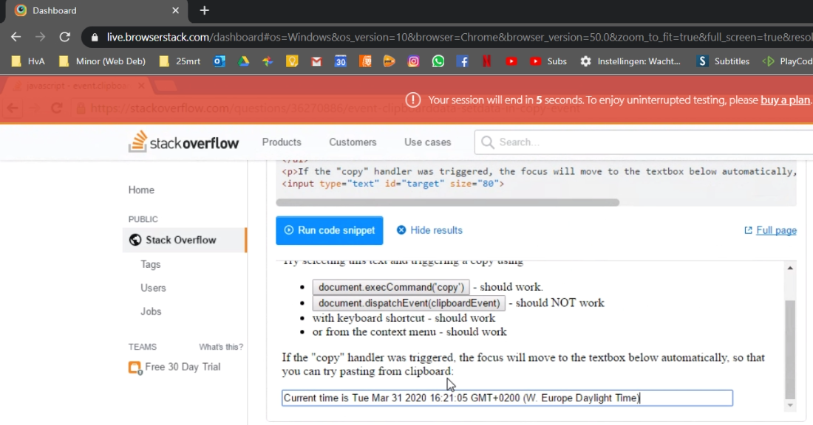
</details>

Dit betekent dat deze fucntioaliteit werkt op minimaal versie 50 van chrome. Volgens https://caniuse.com/usage-table wordt chrome het meest gebruikt bij gebruiekrs vanaf versie 63. Als het op versie 50 van chrome werkt datn werkt het bij grotendeels van de chrome grbiukers. Volgens https://caniuse.com/usage-table gebruiken de meeste gebruikers van firefox minimaal versie 72. Na dezelfde test te hebben uitgeoverd bleek het in deze versie ook te werken (zie afbeelding hierodnder).

<details>
<summary>Firefox 72 werkend</summary>

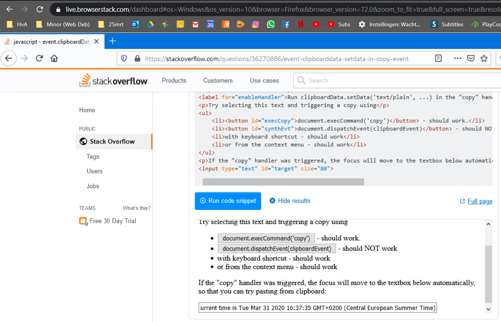
</details>

Aangezien caniuse.com niet complete/foute data had probeerde ik deze code snippet uit te voeren op IOS Safari. Volgens caniuse.com en developers.mozilla was het onbekend of Document API: copy event werkte op IOS safari.

<details>
<summary>Document API: copy op CanIuse.com en developers.mozilla</summary>

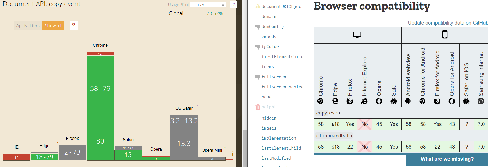
</details>

DataTransfer API: setData zou niet eens werken op IOS-safari volgens dezelfde sites (zie afbeeldign hieronder).

<details>
<summary>DataTransfer API: setData op CanIuse.com en developers.mozilla</summary>

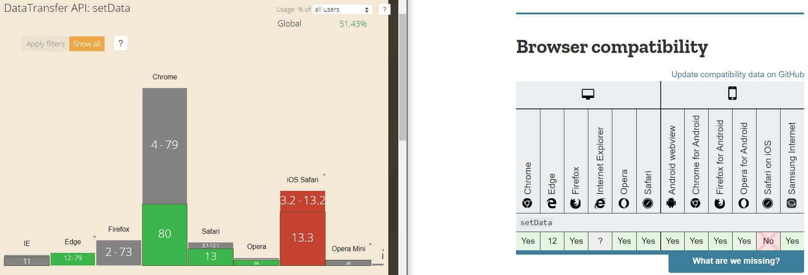
</details>

Ik heb het op een iPhone 8 met IOS 13.3 getest en op een iPad met IOS 13.4, beide op safari, en het blijkt dus wel te werken! 

<details>
<summary>iPhone test</summary>

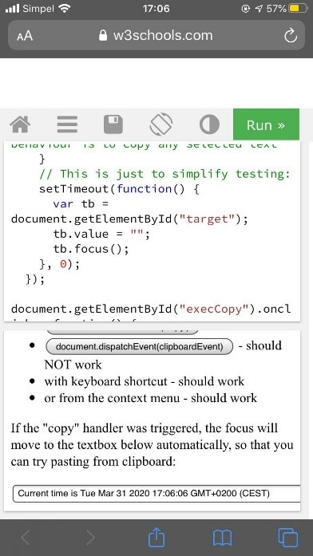
</details>

<details>
<summary>iPad test</summary>

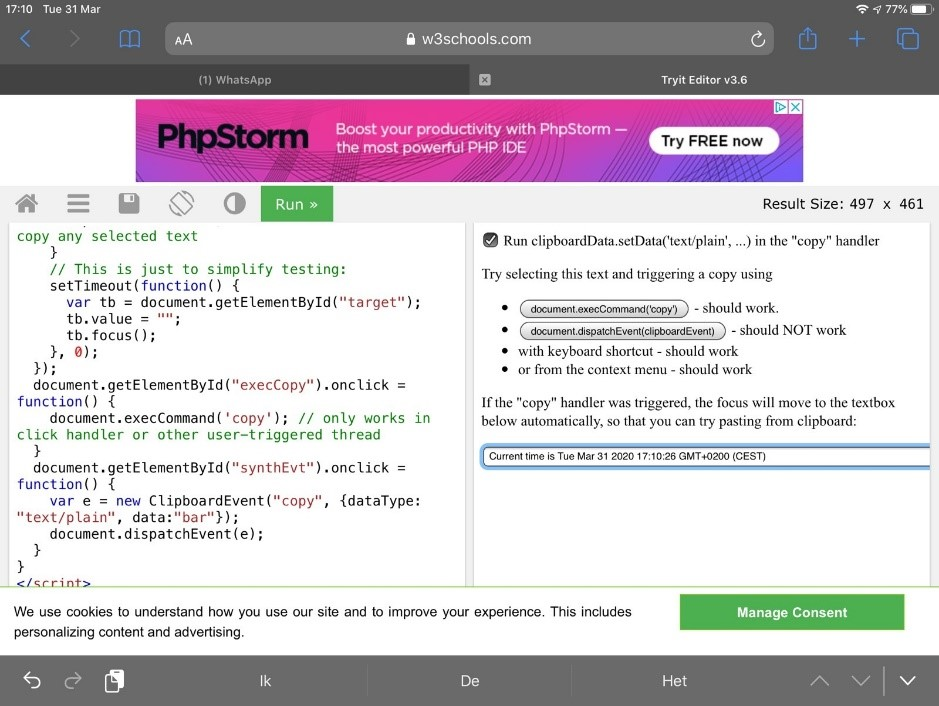
</details>

Ik moest wel een paar keer klikken op de knop om het te laten werken, maar deed het uiteindelijk wel. Wel werkte het 100% van de tijd nadat ik vanuit het context menu op “Copy” klikte en via de drie-finger-pinch-gesture (nieuw sinds de nieuwste versie van iOS waarmee je tekst kan kopiëren). Direct nadat ik op “Copy” klikte, veranderde mijn klembord naar de huidige tijd (wat het voorbeeld van de code snippet gebruikt).

<details>
<summary>iOS menu</summary>

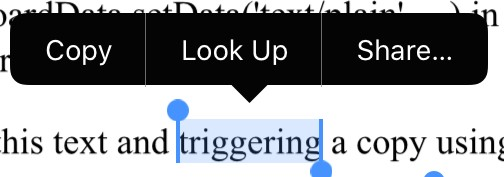
</details>

#### Verwerking bevindingen

De code snippet die ik gebruikt heb voor het testen (https://stackoverflow.com/a/36380702/11119707) heb ik uitgevoerd op firefox versie 72 en IOS 13.3 op safari. Op allebei deze browsers/toestellen werkte deze code snippet.

<details>
<summary>Code snippet - Stackoverflow</summary>

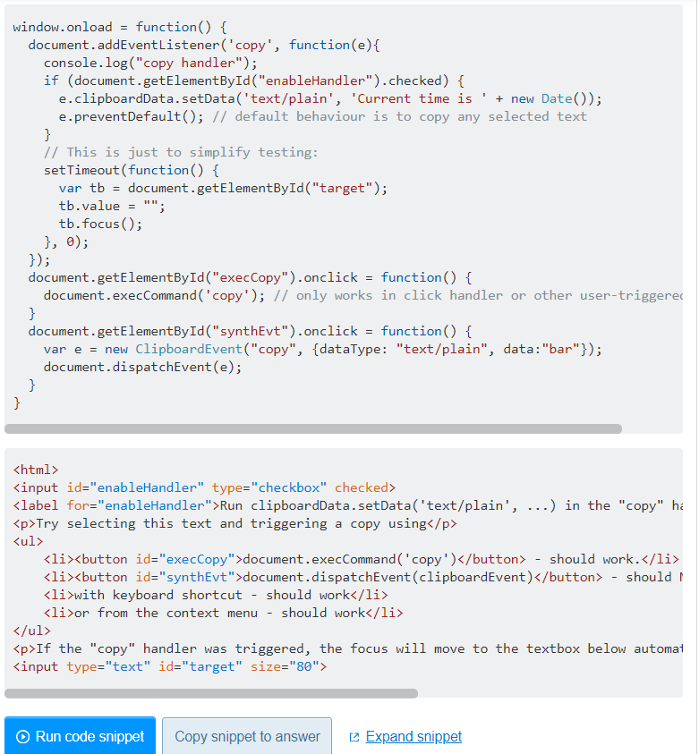
</details>

Dat betkent dat de voglende features ook allemaal werken op deze platformen, aangezien deze allemaal voorkwamen in de code snippet:
*	Document API: execCommand 
*	Document API: copy event
*	DataTransfer API: setData

##### Document API: copy event 

Wat betekent dat voor Document API: copy event? Dit waren de resultaten volgens caniuse.com en developers.mozilla:

<details>
<summary>Document API: copy op CanIuse.com en developers.mozilla</summary>


</details>

Het perecentage van de hoeveel gebruikers die dit kunnen gebruiken was 73.5%. Aangezien het werkt op Firefox 72 zou het betekenen dat dit percentage met 3.5% zou stijgen. Als het op alle versies van firefox zou werken zou dit percentage stijgen met 4.4%. Door de support op IOS-safari 13.3 stijgt deze warde met 9.3%. Als het zou werken met oudere versies van IOS, zou deze waarde zelfs s tijgen met 12.9% (bron: https://caniuse.com/usage-table). Hier nog even alles op een rijtje:

| Platform | Percentage |
| --- | --- |
| Firefox  | 3.5% - 4.4% |
| iOS -Safari | 9.3% - 12.9% | 
|  |   | 
| Totaal: | 12.8% - 17.3% | 

Door deze bevindingen ligt het percentage nu minimaal 12.8% - 17.3% hoger. Het nieuwe percentage zou dus tussen de 86.3% en 90.8%. Dat is een stuk hoger dan 73.5%. 

#### DataTransfer API: setData

Wat betekent dat voor DataTransfer API: setData? Dit waren de resultaten volgens caniuse.com:

<details>
<summary>Document API: copy op CanIuse.com en developers.mozilla</summary>


</details>

Het perecentage van de hoeveel gebruikers die dit kunnen gebruiken was 51.4%, erg laag dus. Aangezien het werkt op Firefox 72 zou het betekenen dat dit percentage met 3.5% zou stijgen. Als het op alle versies van firefox zou werken zou dit percentage stijgen met 4.4%. Door de support op IOS-safari 13.3 stijgt deze warde met 9.3%. Als het zou werken met oudere versies van IOS, zou deze waarde zelfs s tijgen met 12.9%. Ook werkte dit in versie 50 van chrome, dit bekent dat het percentage met maar liefst 19.5% tot 20.2% zou stijgen. (bron: https://caniuse.com/usage-table). Hier nog even alles op een rijtje:

| Platform | Percentage |
| --- | --- |
| Firefox  | 3.5% - 4.4% |
| iOS -Safari | 9.3% - 12.9% | 
| Chrome | 19.5% - 20.2% | 
|  |   | 
| Totaal: | 32.3% - 37.5% | 

Door deze bevindingen ligt het percentage nu minimaal 32.3% - 37.5% hoger. Het nieuwe percentage zou dus tussen de 83.7% en 88.9%. Dat is een stuk hoger dan 51.4%.

Aangezien de percentages van DataTransfer API: setData (83.7% en 88.9%) lager liggen dan die van Document API: copy (86.3% en 90.8%.), gebruiken we die percentages. 

Dus de Document API + DataTransfer API aanpak heeft een bereik tussen de 83.7% en 88.9%. Het heeft support voor alle browsers naast IE en Safari – Desktop.

#### Best keuze

Door de voorafgaande hoofdstukken kunnen we een conclusie trekken over de aanpakken: Document API + DataTransfer API en Async Clipboard API. Hier nog even een klein overzicht van de resultaten:

| Aanpak: | Document API + DataTransfer API | Async Clipboard API |
| --- | --- | --- |
| Bereikbaarheid (in %) | 83.7% en 88.9%. | 81.1% en 84.7%. |
| Werkt niet op: | IE  | Safari + IE |

Uit het onderzoek blijkt dat de Document API + DataTransfer API aanpak een groter bereik heeft en werkt op Safari. Dus op het eerste gezicht lijkt die aanpak beter te zijn. Toch werkt de Async Clipboard API aanpak asyncroon. Dit houdt in dat andere javascirpt code niet gehinderd/gepauzeert wordt zodra dit uitgevoerd wordt. Dit is wel het geval bij de Document API + DataTransfer API aanpak. Daarom ben ik tot de conclusie gekomen om de Async Clipboard API aanpak als eerste te gebruiken en de Document API + DataTransfer API aanpak te gebruiken als fallback hierop.

### Fall back

document.execCommand('copy'). (Covarage: 94%)

Voordelen: 
*	Wordt door veel browsers ondersteund. Maarliefst 94% globaal van de gebruikers zou dit kunnen gebruiken
*	Goed om als fallback te gebruiken

Nadelen:
*	De code nodig om dit uit te voeren werkt synchroon. Dit betekent dat het de javascript op de pagina stopt tot de taak voltooid is.
*	De tekst moet gelezen worden vanuit de DOM en vervolgens op het klembord gezet worden. Er moet in dit geval een input aanwezig zijn, daarop gefocues worden en vervoglens de copy event uitvoeren. 
*	Kan een prompt geven (Alleen IE doet dit, zie bron) die vraagt voor toestemming aan de gebruiker (zie afbeelding)

<details>
<summary>Caniuse.com resultaten</summary>

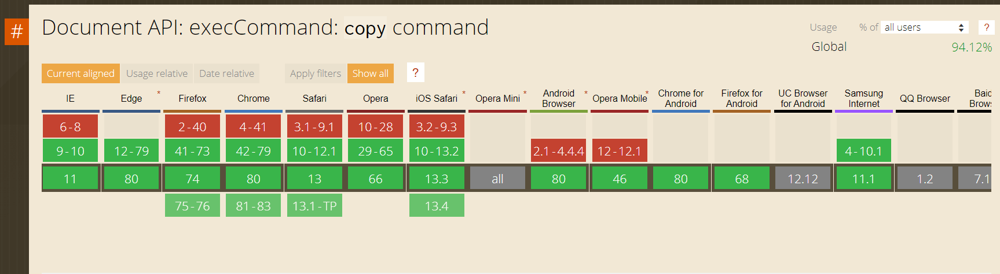
</details>
<details>
<summary>Internet Explorer pop-up</summary>

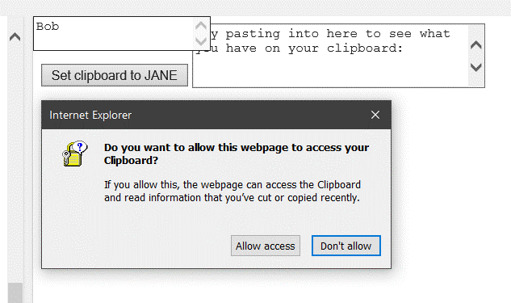
</details>

### Hoe werkt het?

#### Hoe maak ik de knop zichtbaar?
Knop verberg ik origineel met `style="visibility:hidden`:

```html
<a id="copyButton" class="question-navigate-button" style="visibility:hidden">
                        <p>Copy Pin</p>
                    </a>
```

Als javasciprt aanweig is haal ik de inline visibility property weg. Dit is het eerste wat uitgevoerd wordt vanwege de `init()`. De knop is werkt alleen als javascirpt aanwezig is, dus op deze manier is hij ook alleen zichtbaar als JS werkt.

```javascript
init();

function init() {
    document.getElementById("copyButton").style.visibility = "";
}
```
Opacity was een alternatieve optie die beter zou zijn voor performance (bron: https://www.sitepoint.com/hide-elements-in-css/). Alleen de knop is nog wel klikbaar als `opacity: 0` is. Een andere optie was om `dispaly:hidden` te doen, alleen browser suppport was daar niet zo goed voor. Uiteindelijk heb ik `visibility:hidden` gekozen omdat het een excellente browser support heeft en redelijke goede performance score.

#### Hoe wordt tekst gekopieerd?

in de `init()` zet ik de text variabele van de pin. De pin is het laatste deel van de url, vandaar deze one-liner:
```javascript
try {
        text = window.location.pathname.split("/").pop();

        document.getElementById("copyButton").style.visibility = "";
    } catch (e) {
        console.log("cannot set text to copy");
    }
```
Als dit niet werkt wordt het opgevangen in een catch en blijft de button onzichtbaar.

Als de gebruiker op de kopieer text knop klikt, wordt deze event aangeeropen:

```javascript
document.getElementById("copyButton").onclick = function () {
    copyTextToClipboard();
};
```

Vervolgens wordt deze functie aangeroepen:

```javascript
function copyTextToClipboard() {
    if (navigator.clipboard) {
        copyTextToClipboardStandard();
    } else {
        if (typeof ClipboardEvent !== "function") {
            setCopyInputField();
        }

        try {
            var successful = document.execCommand('copy');
            var msg = successful ? 'successful' : 'unsuccessful';
            console.log('(3) Copying text command was ' + msg);
        } catch (err) {
            console.log('(3) Oops, unable to copy');
        }

        if (typeof ClipboardEvent !== "function") {
            removeCopyInputField();
        }
    }
}
```

Eerst check ik of Async Clipboard API werkt door `if (navigator.clipboard)`. Als dat het geval is roep ik deze functie aan:

```javascript
function copyTextToClipboardStandard() {
    navigator.clipboard.writeText(text).then(function () {
        console.log('(1) Async: Copying to clipboard was successful!');
    }, function (err) {
        console.error('(1) Async: Could not copy text: ', err);
    });
}
```

`navigator.clipboard.writeText(text).` vervangt de klembord waarde van de gebruiker. Als dit niet mogelijk is wordt deze code uitgevoerd:
```javascript
        if (typeof ClipboardEvent !== "function") {
            setCopyInputField();
        }

        try {
            var successful = document.execCommand('copy');
            var msg = successful ? 'successful' : 'unsuccessful';
            console.log('(3) Copying text command was ' + msg);
        } catch (err) {
            console.log('(3) Oops, unable to copy');
        }

        if (typeof ClipboardEvent !== "function") {
            removeCopyInputField();
        }
```

Met `typeof ClipboardEvent !== "function"` check ik of het nodig is om de laatste fallback te gebruiken, hier kom ik later op terug.

Met `var successful = document.execCommand('copy');` voer ik een commando uit genaamd "copy". Dit zorgt er voor dat `document.addEventListener('copy'), ` aangeroepen wordt. Dit wordt dan uitgevoerd.

```javascript
document.addEventListener('copy', function (e) {
    if (navigator.clipboard) {
        copyTextToClipboardStandard(text);
    } else if (typeof ClipboardEvent === "function") {
        try {
            e.clipboardData.setData('text/plain', 'Current time is ');
            
            e.preventDefault();  // default behaviour is to copy any selected text

            console.log('(2) copied!');
        } catch (err) {
            console.log('(2) Oops, unable to copy');
        }
    }
});
```

Eerst check ik of Async Clipboard API uitgevoerd kan worden door middel van:`if (navigator.clipboard)`. Deze event kan namelijk ook aangroepen worden door CRTL+C te gebruiken of via het rechtermuisknop menu te kopieren. Als dit niet ondersteund wordt check ik of ClipboardEvent ondersteund wordt: `(typeof ClipboardEvent === "function")`. Ik check hier of ClipboardEvent wordt gezien als een `function` of als `undefined`. Als dit aanwezig is wordt de volgende code uitgevoerd:

```javascript
e.clipboardData.setData('text/plain', text);
            
e.preventDefault();  // default behaviour is to copy any selected text
```

`e.clipboardData.setData` "hijacked" het kopieer event en vervangt het met zijn eigen waarde. Om er voor te zorgen dat de tekst die de gebruiker geselcteerd heeft neit gekopieerd wordt, gebruik ik: `e.preventDefault();`. 

Als `ClipboardEvent` undefined is dan wordt de laatste fallback gebruikt. De laatste fallback werkt op een unieke manier en kan gezien worden als een "hack". Als blijkt dat de laatste fallback nodig is om te gebruiken wordt `setCopyInputField();` aangeroepen:

```javascript
if (typeof ClipboardEvent !== "function") {
    setCopyInputField();
}
```

Hier is de code (bron: https://stackoverflow.com/questions/400212/how-do-i-copy-to-the-clipboard-in-javascript/30810322#30810322):

```javascript
function setCopyInputField() {
    textArea = document.createElement("textarea");

    // *** This styling is an extra step which is likely not required. ***
    //
    // Why is it here? To ensure:
    // 1. the element is able to have focus and selection.
    // 2. if element was to flash render it has minimal visual impact.
    // 3. less flakyness with selection and copying which **might** occur if
    //    the textarea element is not visible.
    //
    // The likelihood is the element won't even render, not even a
    // flash, so some of these are just precautions. However in
    // Internet Explorer the element is visible whilst the popup
    // box asking the user for permission for the web page to
    // copy to the clipboard.
    //

    // Place in top-left corner of screen regardless of scroll position.
    textArea.style.position = 'fixed';
    textArea.style.top = 0;
    textArea.style.left = 0;

    // Ensure it has a small width and height. Setting to 1px / 1em
    // doesn't work as this gives a negative w/h on some browsers.
    textArea.style.width = '2em';
    textArea.style.height = '2em';

    // We don't need padding, reducing the size if it does flash render.
    textArea.style.padding = 0;

    // Clean up any borders.
    textArea.style.border = 'none';
    textArea.style.outline = 'none';
    textArea.style.boxShadow = 'none';

    // Avoid flash of white box if rendered for any reason.
    textArea.style.background = 'transparent';

    textArea.value = text;

    document.body.appendChild(textArea);
    textArea.focus();
    textArea.select();
}
```

Kort samengevat, wat hier gebeurd is het volgende. Ik creeer een tekstveld en verstop deze zodat de gebruiker hem niet ziet. Vervolgens zet ik de pin-code waarde in het tekstveld en laat de gebruikers focus op deze tekstveld zetten. Vervolgens wordt de kopieer command uitgevoerd om de geselecteerde tekstveld inhoud te kopieren:

```javascript
        try {
            var successful = document.execCommand('copy');
            var msg = successful ? 'successful' : 'unsuccessful';
            console.log('(3) Copying text command was ' + msg);
        } catch (err) {
            console.log('(3) Oops, unable to copy');
        }
```

Tot slot wordt `removeCopyInputField();` aangeroepen om de tekstveld te laten verdwijnen met `document.body.removeChild(textArea);`:

```javascript
if (typeof ClipboardEvent !== "function") {
    removeCopyInputField();
}
```

```javascript
function removeCopyInputField() {
    document.body.removeChild(textArea);
}
```

Er is nu geen spoor meer van het tekstveld te bekennen. Dit allemaal wordt in een hele korte periode uitgevoerd, dus de gebruiker ziet het tekstveld nooit.

Op IE wordt er soms een pop-up getoond om toestemming te vragen aan de gebruiker. Als dit gebeurd kan je het tekstveld wel zien, zoals in deze afbeelding:

<details>
<summary>Internet Explorer pop-up</summary>


</details>

## Pleasurable

Ik gebruik `calc(1rem + 19px);` hier om uit te rekenen hoe breed de age input moet zijn.

```css
#age {
    /* fallback */
    width: 35px;
    /* The arrows of increasing/decreasing the number is 19px wide */
    width: calc(1rem + 19px);
}
```

1 rem blijkt in dit geval perfect te passen voor 2 getallen. De 19px is de ruimte die de twee pijltoetsjes in beslag neemt. Ik maak ruimte voor 2 getallen zodat er precies genoeg ruimte is voor leeftijden van 0 - 99. Zie het invoerveld hieronder:

<details>
<summary>Age input</summary>

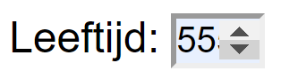
</details>

Als fallback gebruik ik een standaard `width: 35px`, volgens Chrome-dev tools was dit de breedte:

<details>
<summary>Age input breedte</summary>

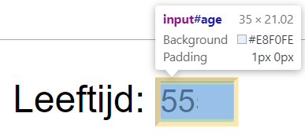
</details>

Hetzelfde principe geldt voor te tekstvelden:

```css
.textareaInput {
    /* this is equal to the font size plus the padding of the textarea */
    min-height: 20px;
    min-height: calc(1rem + 4px);

    /* rows="2" if CSS is turned off */
    height: 36px;
    height: calc(2rem + 4px);
}
```

Hier bereken ik wat de minimale hoogte is voor 1 regel en 2 regels.

Soms wordt `display: flex;` niet ondersteund, als fallback gebruik ik hiervoor `display: table-cell;` (bron: https://stackoverflow.com/questions/24371408/flexbox-alternative-for-ie9). Als flex niet aanwezig is wordt automatisch `display: table-cell;` gebruikt. Dit omdat table-cell ongeveer hetzlfde fungeert, alleen kan er niet gebruik worden gemaakt van bijvoorbeeld: `justify-content`.

```css
.question-wrapper {
    display: table-cell;
    display: flex;

    align-items: center;
    flex-direction: row;
    justify-content: space-between;
    height: fit-content;
}
```
Om de site er mooi uit te laten zien gebruik ik een linear-gradient. Om een linear gradient te maken gebruik ik: `linear-gradient(0deg, #C5796D, #DBE6F6);`. Dit wordt ondersteund door IE 10+, Edge, Firefox 16+, Chrome 26+, Opera 12+ en Safari 7+. 

Als Dit niet werkt heb ik het volgende als fallback gebruikt: `-webkit-linear-gradient(90deg, #C5796D, #DBE6F6);`. Dit werkt op website die op WebKit of Blink gebasseerd zijn (bron: https://developer.mozilla.org/en-US/docs/Web/CSS/WebKit_Extensions). Deze fallback werkt voor Chrome 10-25 en Safari 5.1-6.

Voor nog oudere browsers heb ik een fallback naar een standaard achtergrond: `background: #DBE6F6;`.

Gradient van: https://uigradients.com/#Jaipur

```css
body,
html {
    background: #DBE6F6;
    background: -webkit-linear-gradient(90deg, #C5796D, #DBE6F6);
    background: linear-gradient(0deg, #C5796D, #DBE6F6);
}
```

Om de gebruikerservaring te verbeteren heb ik een fadein animatie geimplementeert. Via `@supports` check ik of animaties ondersteuend worden. Als `animation` of een fallback onderstuend wordt, zoals `-webkit-animation`, dan voeg ik een fadein animatie toe aan de container waar de vraag in staat (bron: https://stackoverflow.com/questions/11679567/using-css-for-a-fade-in-effect-on-page-load):

```css
@supports ((animation: fadein) or
          (-o-animation: fadein) or
          (-moz-animation: fadein) or
          (-webkit-animation: fadein)) {
    .question-container {
        -webkit-animation: fadein 1s; /* Safari, Chrome and Opera > 12.1 */
        -moz-animation: fadein 1s; /* Firefox < 16 */
        -o-animation: fadein 1s; /* Opera < 12.1 */
        animation: fadein 1s;
    }
}
```

Vervolgens roept het de volgende keyframes aan (bron: https://stackoverflow.com/questions/11679567/using-css-for-a-fade-in-effect-on-page-load):
```css
@keyframes fadein {
    from { opacity: 0; }
    to   { opacity: 1; }
}

/* Firefox < 16 */
@-moz-keyframes fadein {
    from { opacity: 0; }
    to   { opacity: 1; }
}

/* Safari, Chrome and Opera > 12.1 */
@-webkit-keyframes fadein {
    from { opacity: 0; }
    to   { opacity: 1; }
}

/* Opera < 12.1 */
@-o-keyframes fadein {
    from { opacity: 0; }
    to   { opacity: 1; }
}
```

`-ms-animation` wordt niet herkend door `@supports`, dus moest ik een alternatief gebruiken. Ik gebruik `@media all and (-ms-high-contrast: none), (-ms-high-contrast: active)` om te checken of de huidige browser IE10 of IE11 zijn (bron: https://stackoverflow.com/questions/18907131/detecting-ie11-using-css-capability-feature-detection). `-ms-high-contrast: none` en `-ms-high-contrast: active` komen beide, samen, alleen voor in IE10 en IE11. Aangezien `animation` alleen werkt in deze versies van IE, heb ik deze detectie methode gekozen:

```css
@media all and (-ms-high-contrast: none), (-ms-high-contrast: active) {
    .question-container {
        -ms-animation: fadein 1s; /* Internet Explorer */
    }
}
```

Vervolgens roept het de volgende keyframe aan (bron: https://stackoverflow.com/questions/11679567/using-css-for-a-fade-in-effect-on-page-load):

```css
/* Internet Explorer */
@-ms-keyframes fadein {
    from { opacity: 0; }
    to   { opacity: 1; }
}
```

## Alle lagen

<details>
<summary>Alleen laag 1</summary>

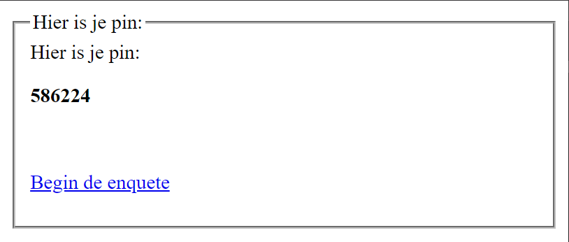
</details>

<details>
<summary>Laag 1 + 2</summary>

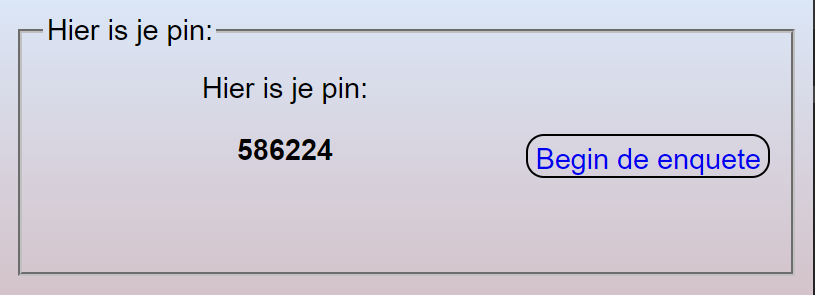
</details>

<details>
<summary>Alle lagen</summary>

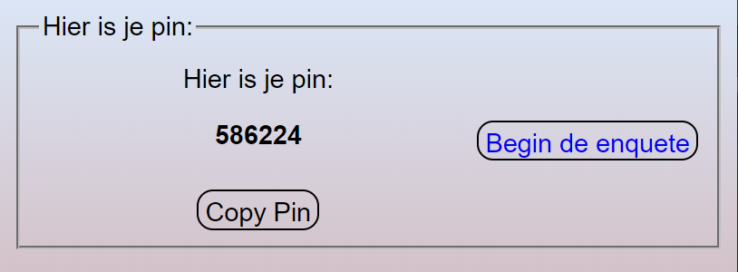
</details>

## Conclusie/samenvatting