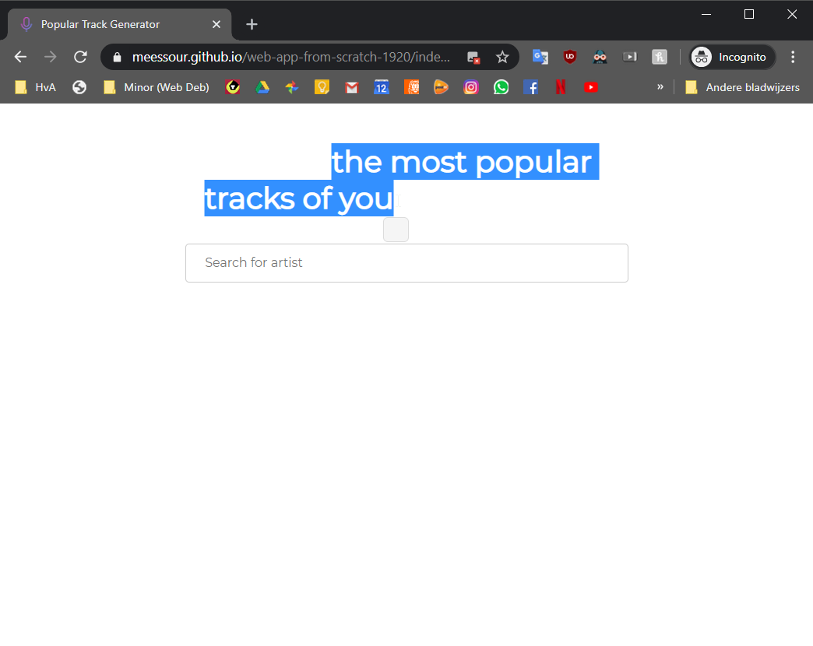
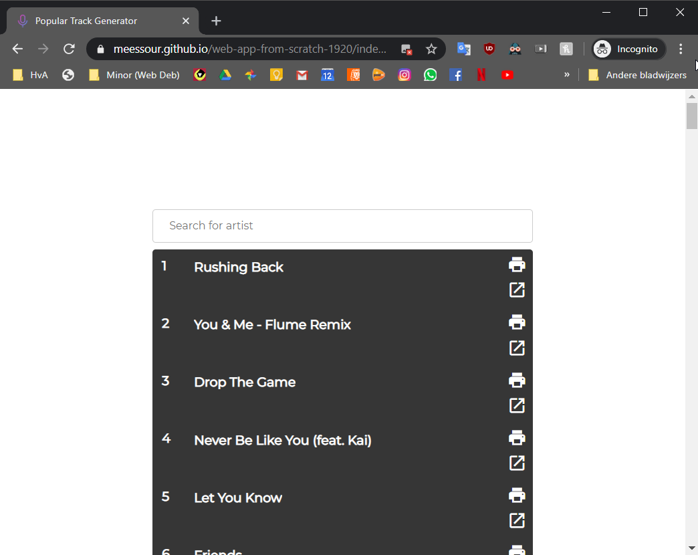
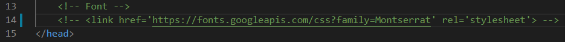
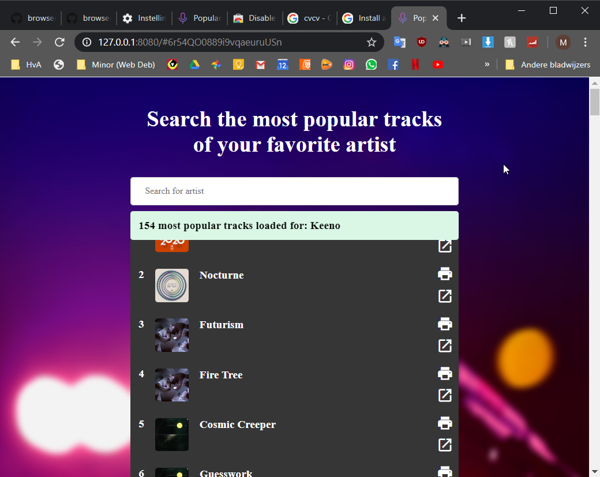
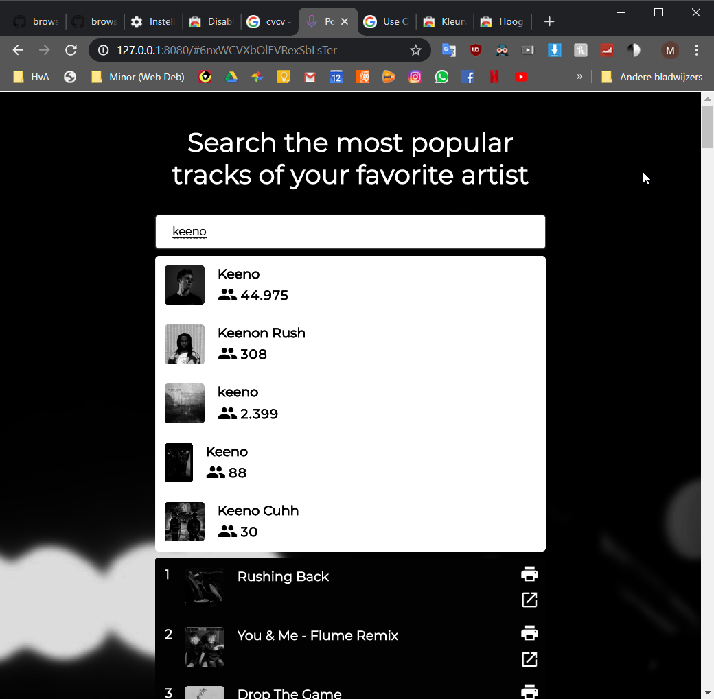
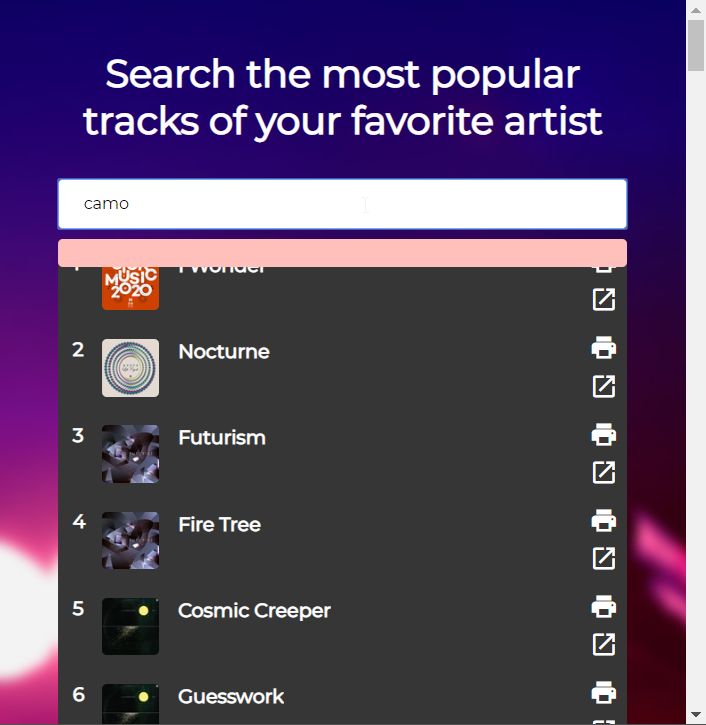
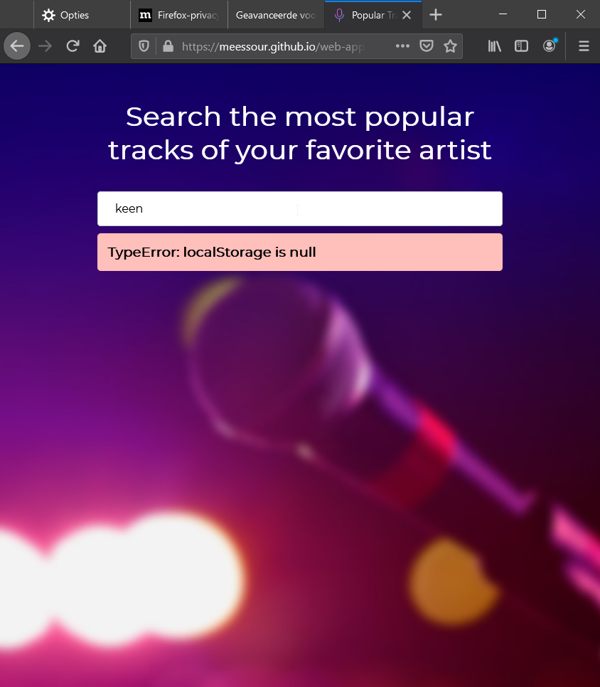
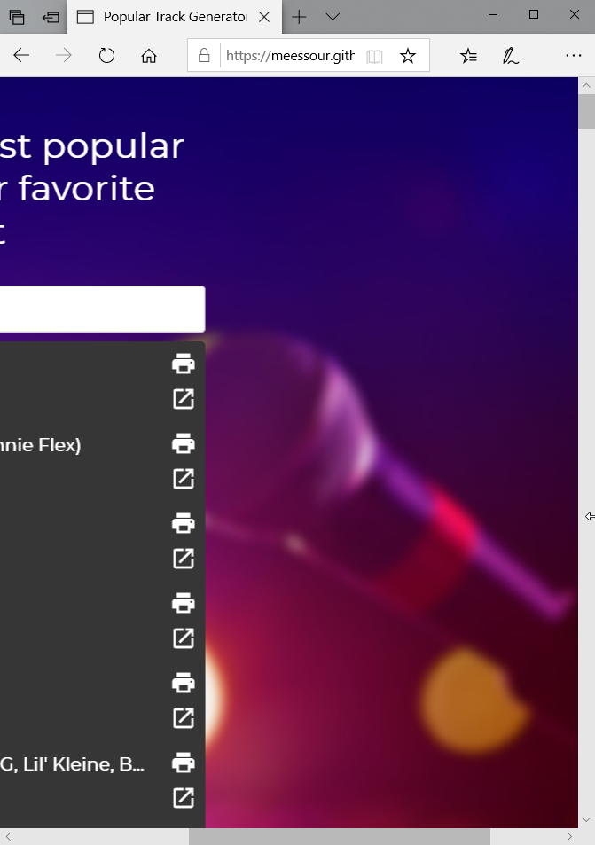
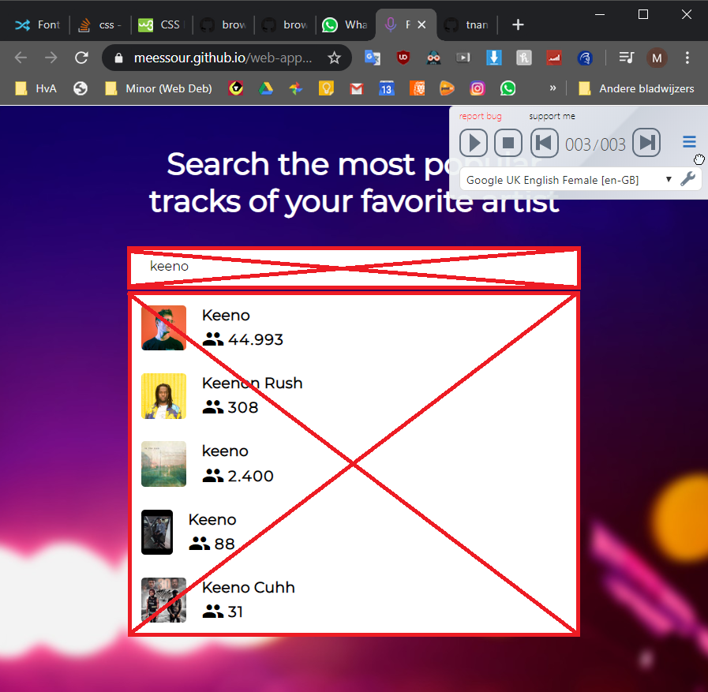
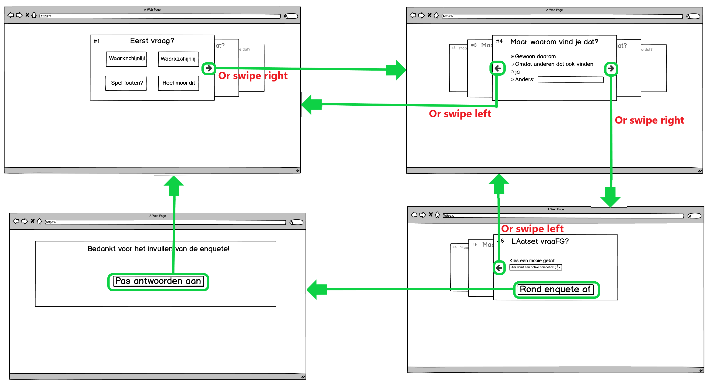

# Browser Technologies
### Week 1

<details>
<summary>Zie bevindingen van week 1</summary>

Deze sectie gaat over toepassingen van Progressive enhancement. Er wordt getest via de Chrome browser via desktop

Ik ga deze web app testen op de volgende beperkingen:
- Afbeeldingen uitzetten
- Custom fonts uitzetten
- Kleur uitzetten & kleurenblindheid instellen
- Muis/Trackpad werkt niet
- Breedband internet uitzetten
- Javascript (volledig)
- Cookies niet accepteren
- localStorage doet het niet

#### Afbeeldingen uitzetten
Na het uitzetten van de afbeeldingen was de titel/omschrijving van de app niet te lezen. Dit komt omdat de achtergrond en text dezelfde kleur hebben
<details>
<summary>Zie voorbeeld</summary>


</details>

De tweede bevinding is dat de achtergrond van de zoekresultaten niet te zien is omdat het dezelfde kleur is als de achtergrond.

Ook wordt er een iccontje getoond op de locatie waar normaal de foto van de artiest te zien is. 

Daarnaast is de outlining van verschillende artiesten in de lijst niet gelijk.
<details>
<summary>Zie voorbeeld</summary>


</details>

Tot slot is er in de resultaten lijst een te grote afstand tussen de positienumering en tracknaam.
<details>
<summary>Zie voorbeeld</summary>


</details>

#### Font uitzetten
Na het uitzetten van de font functioneert de site nog exact hetzelfde. Door de automtische "fallback" font is de text moeilijker te lezen en past het niet bij de site.

<details>
<summary>Zie voorbeeld</summary>




</details>

#### Kleur uitzetten & kleurenblindheid instellen
Na het uitzetten van de kleuren is alles op de site nog goed te lezen. Wel is het moeilijk om de track resultaten sectie te onderscheiden van de achtergrond, ze hebben allebei een zwarte kleur nu. 

<details>
<summary>Zie voorbeeld</summary>



</details>

#### Muis/Trackpad werkt niet
Het is mogelijk om via TAB en/of SHIFT+TAB te navigeren tussen klikbare elementen op de site. Dit zijn: de zoekbalk, de zoekresultaten en open een track in spotify. Elementen zijn te selecteren door op ENTER te klikken.

#### Breedband internet uitzetten
Na het uitzetten van het internet wordt er autmoatisch een foutmedlign gegeven aan de gebruiker, alleen bevat deze geen tekstinhoud. Dit gebeurd zodra de gebruiker probeert te zoeken op een term of een zoekresultaat aan klikt.

<details>
<summary>Zie voorbeeld</summary>



</details>

#### Javascript (volledig)
Na het uitzetten van javascirpt worden er geen zoekresultaten en track resultaten weer gegeven. Er wordt ook geen feedback aan de gebruiker gegeven waardoor de grbuiker niet weet wat er aan de hand is. Het kan er voor zorgen dat de gebruiker denkt dat er nog wat geladen moet worden en kijkt vervolgens dan voor een lange periode naar het scherm, hopende dat er nog wat geladen zal worden.

<details>
<summary>Zie voorbeeld</summary>


</details>

#### Cookies niet accepteren
Na het uitzetten van de cookies worden er geen zoekresultaten en track resultaten weer gegeven. Er wordt een fout melding gegeven.

<details>
<summary>Zie voorbeeld</summary>


</details>

#### localStorage doet het niet
Na het uitzetten van de localStorage worden er geen zoekresultaten en track resultaten weer gegeven. Er wordt een fout melding gegeven.

<details>
<summary>Zie voorbeeld</summary>



</details>

## Tests op verschillende browsers

#### Microsoft edge (Desktop)
In microsoft edge werkte alles prima, alleen is er een visuele beperking bij het verkleinen van het scherm. De gebruiker is in staat om buiten de content (naar rechts) te scrollen. Het lijkt wel alsof er geen maxmimale width aanwezig is.

<details>
<summary>Zie voorbeeld</summary>



</details>

Daarnaast werd er een waarschuwing in the console getoond: 
```SEC7139: [CORS] The origin 'https://meessour.github.io' used the maximum Access-Control-Max-Age value of '604800' as the provided value exceeded this for a cross-origin request to 'https://api.spotify.com/v1/search?q=k&type=artist&limit=5'. ```

#### Firefox (Desktop)
Op Firefox (desktop) functioneerde alles naar wens

#### Safari (Mobile/iPad) & Chrome (iPad)
In Safari op een iPhone/iPad en Chrome op een iPad, waren er enkele visuele problemen. De titel van de site heeft een te grote afstand per letter. Voor een fractie van een seconde ziet de achtergrond er vreemd uit.

<details>
<summary>Zie voorbeeld iPhone Safari</summary>


</details>

<details>
<summary>Zie voorbeeld iPad Chrome</summary>


</details>

Daarnaast is de outlining van track items niet hetzelfde (Niet het geval op iPad (Chrome/Safari)).

<details>
<summary>Zie voorbeeld iPhone Safari</summary>


</details>

#### Firefox (Mobile)
In Firefox op een mobiel werkte alles naar wens. Er was alleen een ongewenste visuele eigenschap tijdens het indrukken van de zoekbalk. De zoekbalk werd dan heel erg transparant, waardoor de placeholder tekst niet meer goed te lezen was

<details>
<summary>Zie voorbeeld</summary>


</details>

#### Internet Explorer (Desktop)
In Internet Explorer werkte eigenlijk helemaal niks. Geen items werden ingeladen, er werd geen user feedback gegeven en de console gaf wat warnings en errors. Visueel zag alles er normaal uit.

<details>
<summary>Zie voorbeeld</summary>


</details>

## Screenreader
Voor het uitlezen van de inhoud van de site gebruikt ik (Pericles: Text to Speech Screen Reader): https://chrome.google.com/webstore/detail/pericles-text-to-speech-s/oacindbdmlbdeidohafnfocfckkhjlbg

De titel/omschrijving van de site werd opgelezen en all track resultaten. De zoek resultaten van de artiesten werden niet opgelezen.

<details>
<summary>Zie wat niet werd voorgelezen</summary>



</details>
</details>

### Week 2

<details>
<summary>Zie bevindingen van week 2</summary>

#### Use case:
**Ik wil een enquete kunnen invullen over de minor Web Development, met verschillende antwoord mogelijkheden. Als ik de enquete niet afkrijg, wil ik later weer verder gaan met waar ik ben gebleven.**


In deze wireframe/wireflow zie je een schets van hoe de app er uit moet komen te zien.

<details>
<summary>Wireframe</summary>



</details>

De gebruiker kan vragen beantwoorden op verschillende manieren. Deze manieren zijn bijvoorbeeld meerkeuze vragen, radio-button vragen, vragen waar een antwoord uitgeschreven moet worden, ect. De gebruiker ziet een preview van de vorige 2 vragen en/of volgende 2 vragen, mits het scherm groot genoeg is. De gebruiker kan op de knoppen klikken om naar de vorige of volgende vraag te komen. Als de gebruiker een touchscreen heeft, dan kan er ook geswiped worden om tussen de vragen te wisselen. Ook is er de mogelijkheid om met pijltoetsjes heen en weer te gaan.

#### Functional/reliable
De core-funtionaliteit van de site is om voor gebruikers een enquete in te vullen. Dit wordt bereiekt doormiddel van verschillende input manieren. De gebruiker kan navigeren door de enquete om de andere vragen te kunnen zien. Tot slot kan de gebruiker de enquete inleveren en de antwoorden aanpassen.

De site is betrouwbaar omdat de gebruiker zijn/haar antwoorden kan bekijken en veranderen. Daarnaast bewaart de site de antwoorden die de gebruiker ingevuld had. Hierdoor kan de gebruiker later de enquete verder invullen.

Dit zijn de verschillende HTML tags (semantische HTML elementen) die gebruikt zullen worden voor de structuur:

* Het indrukken van een knop
    * Hiervoor gebruik ik de ```<a>``` tag. Met de a tag kan je tabben op desktop, vandaar dat ik deze gebruik.
* Een antwoord kiezen van radio buttons
    * Hiervoor gebruik ik de input tag met als type **"radio"**: ```<input type="radio">```
* Meerdere antwoorden kiezen via checkboxes
    * Hiervoor gebruik ik de input tag met als type **"checkbox"**: ```<input type="checkbox">```
* Via een tekstveld
    * Hiervoor gebruik ik de input tag met als type **"text"**. Text is de standard type dus dat geef ik niet aan: ```<input>```
* Via een text area
    * Hiervoor gebruik ik de textarea tag: ```<textarea>```
* Via een dropdown
    * Hiervoor gebruik ik de select tag: ```<select>``` met daarin option tags: ```<option>```
* Via een range slider
    * Hiervoor gebruik ik de input tag met als type **"range"**: ```<input type="range">```
* Een kleur kunnen kiezen (Als de browser het support anders negeren)
    * Hiervoor gebruik ik de input tag met als type **"color"**: ```<input type="color">```

Al deze input types worden in een form tag ```<form>``` gezet met aan ```action=""``` atribute.

Elke vraag wrap ik in de tag ```<fieldset>``` met daarin een ```<legend>``` tag voor de titel. 

De titel van de vraag en andere benadrukking gebruik ik de ```<strong>```tag.

Als de gebruiker de optie "Anders" kiest bij een checkbox vraag, dan gebruik ik de ```<span>``` tag om de ```<input>``` inline naast de tekst te zetten.

Voor opmaak van tekst gebruik ik de titel tags: ```<h1>```, ```<h2>```, etc. Voor overige tekst gebruik ik de ```<p>``` tag

Tot slot gebruik ik ```<div>``` tags voor de algemene structuur van de site.

#### Usable
De website is eenvoudig en focused zich op één specifiek doel. Dit doel is het beantwoorden van een vragenlijst. Andere functies die helpen bij het bereiken van dit doel zijn: Het gemakkelijk inzien van alle (al beantwoorden) vragen die de enquete bevat, het kunnen beatnwoorden/aanpassen van een (gegeven) antwoord en het onthouden waar de gebruiker gebleven was met de vragenlijst.

#### Pleasurable
De site geeft duidelijk weer welke vraag de gebruiker aan het antwoorden is en welk(e) antwoord(en) beatnwoord is/zijn. Door gebruik te maken van gebaren (zoals het kunnen swipen met een touchscreen of pijltoetsen op een toetsenbord), kan de gebruiker op een intuitieve en effevtieve manier zijn/haar doel bereiken. Door alleen relevante elementen/funcitonaliteiten te gebruiken is de site minimaal en voelt daarom proffesioneel aan. Er zijn subtiele animaties om de site prettiger aan te laten voelen maar niet dat het een afleidend effect heeft.

## Browser Technologies/features
De volgende features zijn van toepassing op de site:
* Een animatie voor het springen van vraag naar vraag
    * **@keyframes** wordt gebruikt om op een gecontroleerde manier van een bepaalde styling state naar een andere over te gaan.
        * Wordt ondersteund op alle browsers
    * **animation** wordt gebruikt om de animatie te tonen
         * Wordt ondersteund op alle browsers

* Checken hoe breed het scherm is en op basis daarvan de preview tonen van de andere vragen. Als het scherm te klein is zou dit niet getoond moeten worden.
    * **@media** wordt hiervoor gebruikt
        * Wordt ondersteund op alle browsers

* Een filter toepassen om de andere vragen te blurren.
    * **CSS Filter Effects** wordt hiervoor gebruikt met **blur**
        * Wordt niet ondersteund op IE.    
            * De fallback wordt dan om **Opacity** te gebruiken

* Het kunnen navigeren tussen de vragen.
    * **addEventListener** wordt gebruikt om vershcillende handelingen te detecteren
        * Wordt ondersteund op alle browsers
    * **touchstart** en **touchmove** en **touchend** worden gebruikt als listener om een swipe beweging te detecteren. Deze events zijn van toepasing bij een touchscreen bijvoorbeeld.
        * Wordt niet onderstuend op IE, Safari en Opera. Deze feature is optioneel en er kan gebruik worden gemaakt van de knoppen als fallback.
    * **mousedown** en **mousemove** en **mouseup** worden gebruikt als listener om een veeg beweging te detecteren van een muis
        * Wordt ondersteund op alle browsers
    * **onkeydown** wordt gebruikt als loistener om te detetcteren of een pijltoets is ingeklikt. niet bij elke browser wordt de listener **onkeypress** getriggered bij het inklikken van de pijltoetsen., daarom gebruyik ik deze niet. Deze functie is optioneel en zou alleen werken als de gebruiker een toetsenbord heeft
        * Wordt ondersteund op alle browsers
    * **click** word gebruikt als listener om te detecteren of een knop is ingeklikt. Dit wordt ook gebruikt als fallback voor als alle andere events hierboven niet werken.
        * Wordt ondersteund op alle browsers

* Om een thema te kiezen, in de vorm van een subtiele achtergrond kleur, wordt er aan de gebruiker gevraagd om deze kleur op te geven.
    * de input type **color** wordt hiervoor gebruikt.
        * Dit wordt niet onderstuend op IE en wordt in plaats daarvan niet gevraagd aan de gebruiker. Als de gebruiker IE gebruikt of geen kleur kiest, is de fallback kleur gewoon wit.

</details>

</details>

</details>